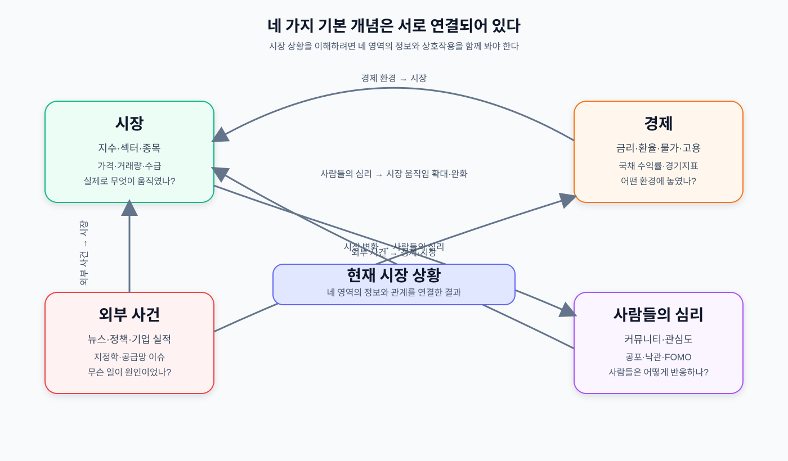

# FINVERSE 시나리오 온톨리지

## 목적

FINVERSE는 사용자의 질문에 맞는 자료를 모은 뒤, 현재 시장 상황을 구조화하고 MiroFish 시뮬레이션으로 미래 시나리오를 만든다.

핵심 순서는 다음과 같다.

```text
사용자 질문
  → 질문에 맞는 검색 범위 결정
  → 시장·경제·외부 사건·사람들의 심리 정보 수집
  → 현재 시장 상황 온톨리지 구성
  → MiroFish 시뮬레이션
  → 사용자 질문에 맞는 미래 시나리오 생성
```

## 네 가지 기본 개념

### 네 가지 개념의 연결관계



[관계도 원본 이미지 열기](./finverse-four-concepts.svg)

네 가지 영역은 각각 따로 존재하지만, 실제 시장 상황에서는 서로 영향을 주고받는다.

### 1. 시장

시장에서 실제로 무엇이 얼마나 움직였는지를 나타낸다.

- 지수: KOSPI, KOSDAQ 등
- 섹터: 반도체, 금융, 자동차 등
- 종목
- 일별 시가·고가·저가·종가·거래량
- 외국인·기관 수급
- 변동률과 변동성
- 최소 1년 이상의 과거 흐름
- 큰 움직임과 연결된 과거 이벤트

### 2. 경제

시장에 영향을 주는 경제적 배경을 나타낸다.

- 환율
- 기준금리
- 단기 국채 수익률
- 5년·10년 국채 수익률
- 물가상승률
- 고용지표
- 경기지표
- 시장 예상값과 실제 발표값의 차이
- 현재 수준과 과거 수준의 비교

### 3. 외부 사건

시장 움직임의 원인이 될 수 있는 사건을 나타낸다.

- 뉴스
- 기업 실적과 전망
- 기업 투자·CapEx
- 정책과 규제
- 무역분쟁
- 전쟁·지정학적 리스크
- 공급망 이슈
- 기관·외국계 분석

각 사건에는 발생 시각, 출처, 관련 시장·섹터·종목, 예상 영향, 실제 시장 반응을 함께 기록한다.

### 4. 사람들의 심리(커뮤니티)

사람들이 시장을 어떻게 받아들이고 있는지를 나타낸다.

- 관련 종목·섹터 언급량
- 긍정·부정 반응
- 공포와 낙관
- FOMO
- 군집행동
- 투자자들의 기대 방향
- 심리 변화 속도

커뮤니티 반응은 시장의 사실이 아니라 투자자 심리의 관측값으로 사용한다.

## 검색 원칙

사용자 질문에 포함된 조건을 가장 먼저 검색한다. 질문에 직접 나오지 않았더라도 분석에 꼭 필요한 정보는 자동으로 보완 검색한다. 영향이 작거나 신뢰할 자료가 부족한 정보는 중립으로 처리한다.

```text
사용자 지정 정보
  → 반드시 검색

분석에 필요한 누락 정보
  → LLM이 판단해 추가 검색

영향이 작거나 근거가 부족한 정보
  → 중립 처리
```

검색 결과는 가능한 한 출처, 수집 시각, 관련 대상, 영향 방향과 함께 저장한다.

## 핵심 관계

```text
외부 사건 → 경제
외부 사건 → 시장
경제 → 시장
시장 → 사람들의 심리
사람들의 심리 → 시장
과거 유사 사례 → 현재 상황 해석
현재 시장 상황 + 사용자 조건 → MiroFish
MiroFish 시뮬레이션 → 미래 시나리오
```
