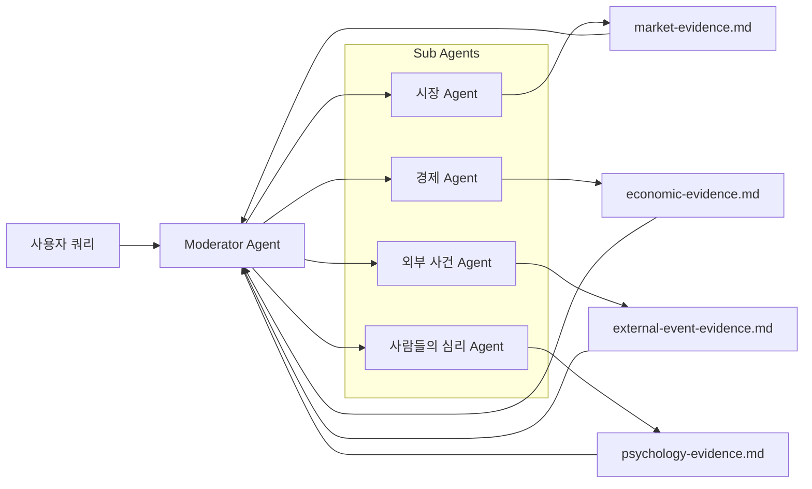

# FINVERSE 온톨로지 구성 A2A Agent 계획

## 1. 전체 구조

사용자 질문을 바탕으로 네 개의 온톨로지 Agent가 PostgreSQL에서 자료를 조회하고, 각자의 분석 문서를 만든다. Moderator Agent는 네 문서를 취합해 부족한 자료를 다시 요청한 뒤 MiroFish에 전달할 온톨로지 자료를 확정한다.

```text
사용자 질문
  ↓
Moderator Agent
  ├─ 시장 Agent
  ├─ 경제 Agent
  ├─ 외부 사건 Agent
  └─ 사람들의 심리 Agent
       ↓
각 Agent의 Evidence 문서
       ↓
Moderator Agent의 검토·재수집
       ↓
현재 시장 상황 온톨로지
       ↓
MiroFish 시뮬레이션
```

첫 번째 테스트 질문:

> 오늘 이후 코스피가 어떻게 변할까?

## A2A 구조



이 질문은 Moderator가 다음처럼 해석한다.

```text
대상: KOSPI
시작 시점: 현재
기간: 기본 30일
목적: 상승·기준·하락 조건을 갖춘 미래 시나리오 준비
```

## 2. Moderator Agent

### Functions

- 사용자 질문 분해
- 분석 대상·기간·기준 시각 결정
- 네 개 Domain Agent에 작업 요청 전달
- Agent 결과 문서 수집
- 문서 간 중복·충돌·누락 검토
- 사실·해석·추정 관계 구분 여부 확인
- 부족한 데이터에 대한 재수집 요청
- 최종 Evidence 문서 4개를 MiroFish 입력용 묶음으로 관리

### Input

```json
{
  "query": "오늘 이후 코스피가 어떻게 변할까?",
  "as_of": "현재 시각",
  "target": "KOSPI",
  "horizon": "30d"
}
```

Moderator는 질문에서 다음을 정한다.

- 분석 대상: KOSPI
- 기준 시각: 데이터 수집 기준 시각
- 분석 기간: 7일·30일·90일 중 하나
- 필요한 온톨로지 영역: 시장·경제·외부 사건·사람들의 심리
- 필요한 결과 경로: 상승·기준·하락

### Output

Moderator의 실제 산출물은 각 Agent가 작성한 내용이 들어 있는 Markdown 문서 4개다. 위의 질문 정보는 내부 작업 명세로만 사용하며, 최종 Output으로 사용자에게 반환하지 않는다.

```text
output/kospi-after-today/
├── market-evidence.md
├── economic-evidence.md
├── external-event-evidence.md
└── psychology-evidence.md
```

각 파일에는 해당 영역의 현재 상태, 주요 영향 요인, 후보 관계, 불확실성, 부족한 데이터를 기록한다. Moderator는 네 문서를 만든 뒤 서로 비교하고, 부족한 내용을 확인한다.

내부 작업 명세는 다음처럼 사용할 수 있다.

```json
{
  "query_id": "kospi-after-today",
  "target": "KOSPI",
  "as_of": "현재 시각",
  "horizon": "30d",
  "required_agents": ["market", "economy", "events", "psychology"]
}
```

각 Agent의 결과를 받은 뒤에는 다음을 확인한다.

- 네 문서의 기준 시각이 같은가
- 사실과 해석이 구분되어 있는가
- 각 관계에 출처가 있는가
- 상승·기준·하락 조건을 만들 수 있는가
- 부족한 데이터가 있는가

부족한 내용이 있으면 특정 Agent에 다시 요청한다.

```text
시장 Agent야. 최근 20거래일 외국인 수급과 반도체 섹터 상대수익률이 부족해.
해당 내용을 추가로 조회해서 Market Evidence를 보완해줘.
```

## 3. 시장 Agent

### Functions

- PostgreSQL 연결
- `market.*` view 조회
- KOSPI·섹터·종목·수급 데이터 필터링
- 최근 기간별 수익률·변동성·거래대금 계산
- 주요 섹터와 종목의 상대 변화 비교
- 외국인·기관 수급의 방향과 지속기간 계산
- 과거 유사 시장 구간 검색
- 데이터 출처·기준 시각·가격 기준 기록
- Market Evidence 문서 생성

### Input

PostgreSQL:

- `market.index_daily`
- `market.price_daily`
- `market.security`
- `market.investor_flow_daily`
- `market.foreign_holding_daily`

Moderator 요청:

```text
현재 KOSPI의 추세, 변동성, 주요 섹터, 외국인·기관 수급과 과거 유사 흐름을 정리해줘.
```

### Output

```markdown
# Market Evidence

## Current State
- KOSPI 현재 수준:
- 최근 5일 변화:
- 최근 20일 변화:
- 최근 60일 변화:
- 변동성:
- 거래대금:

## Dominant Sectors
- 강한 섹터:
- 약한 섹터:
- KOSPI에 영향이 큰 종목:

## Investor Flow
- 외국인:
- 기관:
- 수급 지속 기간:

## Historical Analogues
- 유사한 과거 시장 상황:
- 당시 조건:
- 이후 시장 흐름:

## Market Relation Candidates
- 외국인 순매수 → KOSPI 상승 압력
- 반도체 섹터 약세 → KOSPI 하락 압력
- 변동성 상승 → 위험 회피 가능성

## Limitations
- KRX와 Naver 가격 기준 차이
- 시장 전체 수급과 종목별 수급 단위 차이
- 데이터가 부족한 항목
```

## 4. 경제 Agent

### Functions

- PostgreSQL 연결
- `economy.*` view 조회
- 금리·환율·물가·고용·경기지표 필터링
- 최근 변화와 과거 평균 비교
- 관측 기간·발표 기간·단위 정규화
- 향후 발표 예정 경제지표 조회
- 경제 변수와 KOSPI의 영향 후보 정리
- 데이터 최신성·수정 가능성 기록
- Economic Evidence 문서 생성

### Input

PostgreSQL:

- `economy.observation`
- `economy.series`

Moderator 요청:

```text
현재 금리·환율·물가·고용·경기 환경과 KOSPI로 이어지는 경제적 영향을 정리해줘.
```

### Output

```markdown
# Economic Evidence

## Current Macro State
- 기준금리:
- 원·달러 환율:
- 국고채 금리:
- 물가:
- 고용:
- 산업생산·GDP:

## Recent Changes
- 최근 1개월 변화:
- 최근 3개월 변화:
- 과거 평균과의 차이:

## Upcoming Indicators
- 향후 발표 예정 지표:
- 예상값:
- 실제값 발표 여부:

## Market Relation Candidates
- 금리 상승 → 할인율 상승 → 성장주 압력
- 원화 약세 → 외국인 환차손 우려 → 외국인 매도 가능성
- 경기 회복 → 기업이익 기대 개선 → KOSPI 지지

## Limitations
- 발표 지연 및 수정 가능성
- 미국 경제지표 부족 여부
- 시장과의 직접적인 인과관계 확인 한계
```

## 5. 외부 사건 Agent

### Functions

- PostgreSQL 연결
- `events.*` view 조회
- 뉴스·정책·실적·경제 일정 필터링
- 관련 대상과 기간으로 뉴스 검색
- 중복 뉴스를 하나의 사건 클러스터로 묶기
- 사건의 사실·해석·시장 반응 분리
- 출처·발행 시각·중요도 기록
- 사건별 영향 방향과 반증 조건 정리
- External Event Evidence 문서 생성

### Input

PostgreSQL:

- `events.news`
- `events.news_daily`
- 경제 일정 데이터

Moderator 요청:

```text
최근 KOSPI 관련 뉴스·정책·실적·경제 일정을 사건 단위로 묶고 영향 후보를 정리해줘.
```

### Output

```markdown
# External Event Evidence

## Event Clusters

### Event 1
- 사건명:
- 발생 시각:
- 관련 국가·섹터·종목:
- 확인된 사실:
- 시장의 해석:
- 현재 시장 반응:
- 영향 방향:
- 중요도:
- 출처:

### Event 2
- 사건명:
- 발생 시각:
- 확인된 사실:
- 예상 영향:
- 출처:

## Upcoming Events
- 기업 실적 발표:
- 중앙은행 회의:
- 미국 경제지표:
- 정책·지정학 일정:

## Market Relation Candidates
- AI CapEx 확대 → 반도체 수요 기대 상승
- 반도체 실적 미스 → 이익 추정치 하향
- 지정학적 충격 → 위험 회피 심리 상승

## Limitations
- 뉴스 본문이 아닌 메타데이터 중심 수집
- 동일 사건의 기사 중복 가능성
- 공식 사실과 언론 해석의 구분 필요
```

## 6. 사람들의 심리 Agent

### Functions

- PostgreSQL 연결
- YouTube 채널·영상·댓글 view 조회
- KOSPI·반도체·환율 관련 댓글 필터링
- 기간별 언급량과 변화율 집계
- 긍정·부정·공포·낙관·FOMO 분류
- 반복되는 투자자 내러티브 추출
- 군집행동·손실회피·확증편향 등 행동 신호 분류
- 채널 편향·데이터 대표성·개인정보 제한 기록
- Psychology Evidence 문서 생성

### Input

PostgreSQL:

- YouTube 채널 데이터
- YouTube 영상 데이터
- YouTube 댓글 데이터
- 향후 집계 view: `psychology.sentiment_daily`

Moderator 요청:

```text
KOSPI·반도체·환율에 대한 투자자 관심, 감성, 반복 내러티브와 행동 편향 신호를 정리해줘.
```

### Output

```markdown
# Psychology Evidence

## Attention
- KOSPI 언급량:
- 반도체 언급량:
- 원·달러 언급량:
- 최근 7일 변화율:

## Sentiment
- 긍정:
- 부정:
- 공포:
- 낙관:
- FOMO:

## Dominant Narratives
1. AI 수요가 계속될 것이다
2. 이미 고점일 수 있다
3. 하락하면 추가 매수해야 한다

## Behavioral Signals
- 군집행동:
- 손실회피:
- 확증편향:
- 공포 매도:
- 추격 매수:

## Market Relation Candidates
- 가격 상승 → 관심 증가
- 관심 증가 → 긍정 심리 확대
- 급락 → 공포 댓글 증가
- 공포 증가 → 투매 가능성

## Limitations
- YouTube 이용자 편향
- 채널별 투자 성향
- 봇·중복 댓글 가능성
- 댓글은 시장 사실의 근거가 아님
- API 데이터 보존·만료 정책
```

## 7. 최종 산출물

Moderator는 네 개의 Evidence 문서를 취합해 다음을 만든다.

```text
현재 KOSPI 상태
  + 경제 환경
  + 주요 외부 사건
  + 투자자 심리
  + 엔터티 목록
  + 영향 관계
  + 근거와 출처
  + 불확실성
  + 부족한 데이터
```

이 문서는 확정적인 KOSPI 예측이 아니다. MiroFish가 여러 에이전트의 상호작용을 시작할 수 있도록 현재 시장 환경과 조건을 설명하는 입력 자료다.
